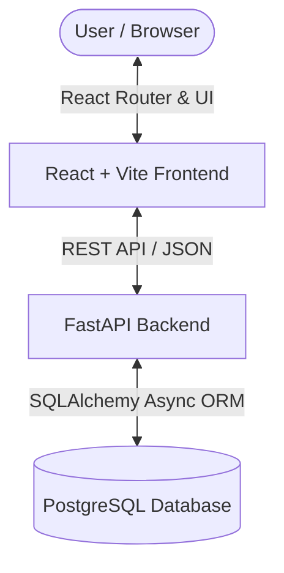

# Real Estate Property Listing Platform

A production-ready, full-stack enterprise-grade Real Estate Property Listing Platform consisting of a high-performance **FastAPI backend** and a modern **React + Vite frontend**.

---

## Architecture & Technology Stack



### Backend (`/app`)
- **Language**: Python 3.13
- **Framework**: FastAPI
- **Database**: PostgreSQL (with UUID keys, soft deletes, timestamps, 3NF normalization)
- **Async Driver & ORM**: AsyncPG + SQLAlchemy 2.0 Async ORM
- **Migrations**: Alembic
- **Containerization**: Docker & Docker Compose
- **Authentication**: JWT Access & Refresh tokens, Role-Based Access Control (RBAC)

### Frontend (`/frontend`)
- **Language & Framework**: JS/React 19, powered by Vite
- **Styling**: Tailwind CSS
- **Routing & State**: React Router, React Hook Form, Yup validation
- **API Client**: Axios with dynamic request interceptors
- **Visuals**: Framer Motion for smooth animations, Recharts for data visualization, Swiper for media carousels

---

## Directory Layout

```text
real-estate-platform/
├── app/                  # FastAPI Backend API Source Code
│   ├── main.py           # Application factory and startup configuration
│   ├── core/             # Security, Logging, Exceptions, Responses, Constants
│   ├── models/           # SQLAlchemy 2.0 Async database models
│   ├── schemas/          # Pydantic v2 schemas for request/response serialization
│   ├── repositories/     # Data access layer (Generic CRUD & custom SQL operations)
│   ├── services/         # Business logic layer
│   ├── routes/           # API routes / controllers
│   ├── middleware/       # Auth parser, error boundary, request logger
│   └── utils/            # Shared helper functions (uploads, mailers, validations)
├── frontend/             # React + Vite Frontend Application
│   ├── src/              # React source code (components, pages, context, hooks)
│   ├── public/           # Static public assets
│   ├── package.json      # Frontend package configuration & npm scripts
│   └── vite.config.js    # Vite bundling and development configurations
├── docker/               # Docker and docker-compose deployment configuration files
├── tests/                # Backend integration and unit tests
├── requirements.txt      # Python backend packages
└── run.py                # Backend local development entry point
```

---

## Getting Started

### Prerequisites
- [Docker & Docker Compose](https://www.docker.com/products/docker-desktop/) (recommended)
- [Python 3.13+](https://www.python.org/downloads/)
- [Node.js 18+](https://nodejs.org/)

---

### Backend Setup

#### Option 1: Local Development Setup
1. Initialize a Python virtual environment and install dependencies:
   ```bash
   python -m venv .venv
   # Windows:
   .venv\Scripts\activate
   # macOS/Linux:
   source .venv/bin/activate

   pip install -r requirements.txt
   ```
2. Set up environment variables:
   ```bash
   cp .env.example .env
   ```
   *(Update the settings inside `.env` to match your local PostgreSQL configuration)*
3. Start the local database container and run database migrations:
   ```bash
   docker compose -f docker/docker-compose.yml up -d postgres
   alembic upgrade head
   ```
4. Run the FastAPI development server:
   ```bash
   python run.py
   ```
   The backend will be available at `http://localhost:8000`. API documentation can be accessed at `http://localhost:8000/docs`.

## Running the Project

To start the local development environments, run the following:

### 1. Backend (via Docker Compose)
Navigate to the `docker` directory and start the containers:
```bash
cd docker
docker compose up -d
```
*(If the containers are already built and stopped, you can run `docker compose start` instead).*

The backend API will be available at `http://localhost:8000`, with interactive Swagger docs at `http://localhost:8000/docs`.

### 2. Frontend
Open a new terminal session, navigate to the `frontend` directory, and start the development server:
```bash
cd frontend
npm run dev
```
*(If navigating from the `docker` directory, run `cd ../frontend` first).*

The frontend application will start at `http://localhost:5173`.
